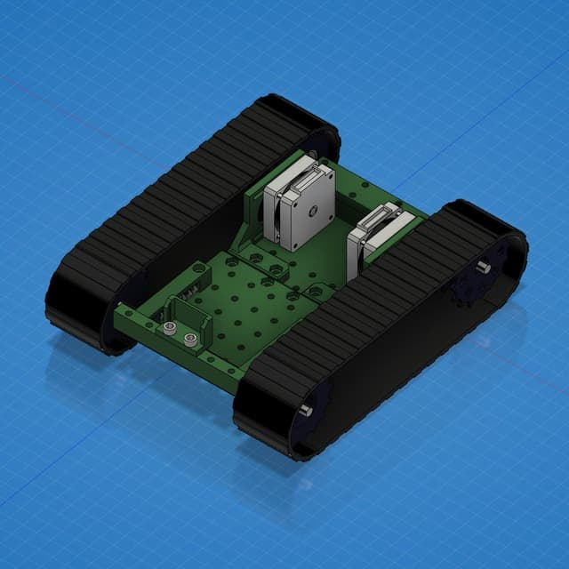

# openTank - opensource tank platform

## Dependencies
- [3d printed parts](https://a360.co/33G5BDA)
- [Plastic Track for Damping Robotic Smart Car Model (1 pcs)](https://www.aliexpress.com/item/32778979359.html?spm=a2g0s.9042311.0.0.27424c4dKxgcJo)
- Raspberry Pi Zero (or Arduino Nano, UNO, Pro Mini)
- Raspberry Pi Camera (optional)
- DC motors
- L298N
- 12V Baterry

## Raspberry Pi realization
* [Raspberry Pi PWM realization using SSH](/opentank/demotank_ssh.py)
* [Raspberry Pi PWM realization using websocket server](/opentank/ws_server.py)

## Arduino realization
* [Arduino PWM realization using radio receiver](/openTankArduino)
