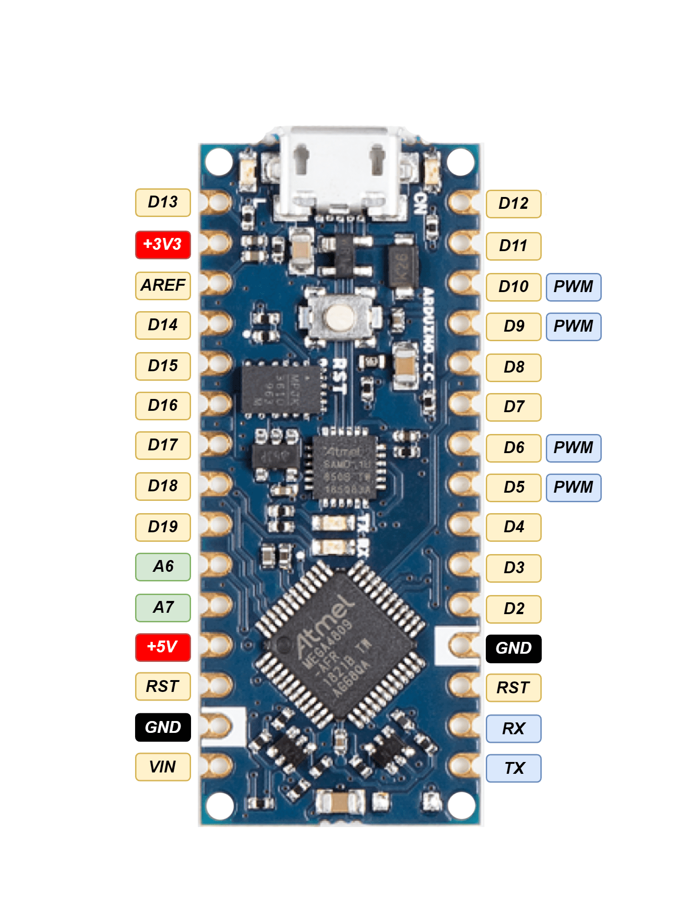

## OpenTank Arduino

- Arduino Nano (ATmega328)
- Any IBus receiver
- DC motors
- L298N
- 12V Baterry

## Arduinio library requirements

- [IBusBM](https://github.com/bmellink/IBusBM)
- [GyverPWM](https://github.com/AlexGyver/GyverLibs/releases/download/GyverPWM/GyverPWM.zip)

## Wiring

| L298N| Arduino Nano  | Receiver |
|--|--|--|
|5V|Vcc|Vcc|
|Gnd|Gnd|Gnd|
| Right motor A | D3|
| Right motor B | D5|
| Left motor A | D9|
| Left motor B | D10|
| | RX| Sbus receiver output|
