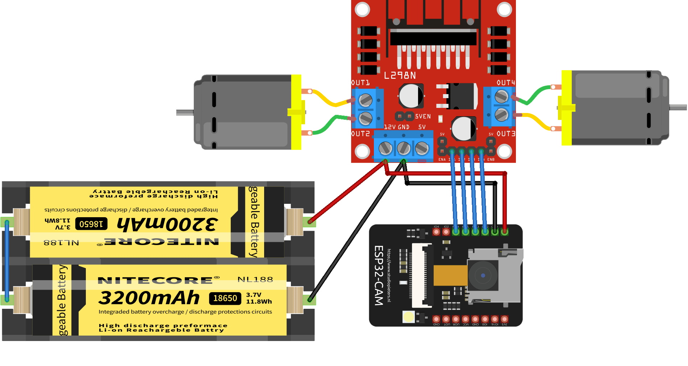

## OpenTank ESP32

<hr>

### How to upload code

1. Install [PlatformIO](platformio.org)
2. Import project
3. Make sure that `upload_port` is the right port of yours esp32 in `platformio.ini` file
3. Upload html page to esp filesystem (Platformio -> esp32cam -> Platform -> Upload Filesystem Image)
4. Build and upload the project code
5. ESP will start Wi-Fi access point with:

    ```
    SSID: OpenTank
    Password: 88888888
    ```

<hr>

## Wiring



* Needs for battery voltage ~5-12V

| L298N| ESP32Cam |
|--|--|
|Vcc|5V|
|Gnd|Gnd|
| Right motor A | IO12|
| Right motor B | IO13|
| Left motor A | IO14|
| Left motor B | IO15|
