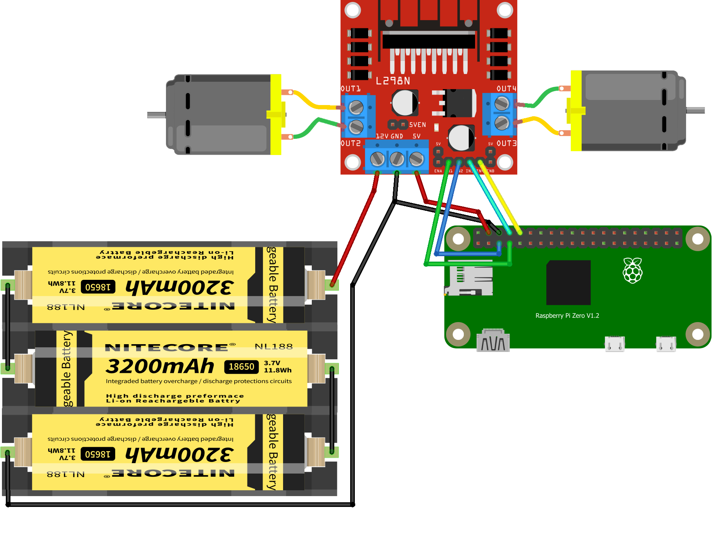

# openTank Raspberry Pi

## Install and run

`pip3 install -r requirements.txt`

### Opentank SSH

1. `python3 demotank_ssh.py`
2. Connect to rpi via ssh and control it by WASD keys

### Opentank web ui (demo)

1. `python3 ws_server.py`
2. Open `web_client.html` in editor
3. Write rpi ip address on line 113

    `var ws = new WebSocket("ws://localhost:8765/ws");`

    edit to:

    `var ws = new WebSocket("ws://192.168.1.3:8765/ws");`

3. Open `web_client.html` in browser and use WASD or joystick to control.

### Start video stream

1. Connect PiCamera to rpi.
2. `raspivid -n -ih -t 0 -rot 0 -w 1280 -h 720 -fps 15 -b 1000000 -o - | nc -lkv4 5001`

### Connect Video stream

1. `pip3 install -r requirements.txt`
2. Edit `rpi_ip` in `tcpcam.py`, write here rpi ip address.
3. `python3 tcpcam.py`
4. Connect to rpi via ssh and control it by WASD keys
5. For exit push Q

## Wiring

* Needs for battery voltage ~5-12V
* L298N 5V output works only with Rpi Zero (with video stream turned off)!

If you want to start video stream or use Raspberry Pi 2/3/4, you should use add DC-DC power converter with at least 1.5-2A 5v output.

| L298N| GPIO.BOARD| GPIO.BCM |
|--|:--:|--|
|Vcc|5V|VCC|
|Gnd|Gnd|Gnd|
| Right motor A | 7 | 4 |
| Right motor B | 5 | 1 |
| Left motor A | 8 | 14 |
| Left motor B | 10 | 15 |
